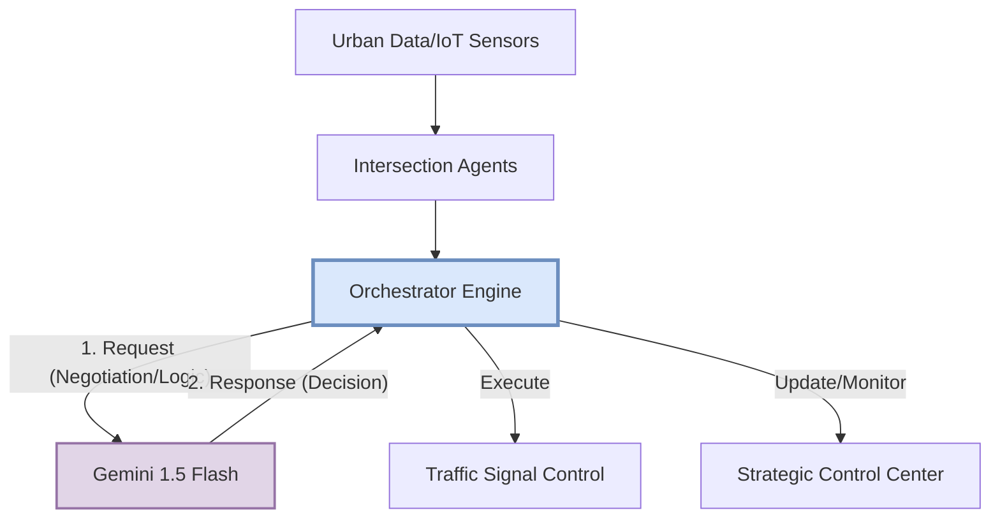

# WiraLalu: National Agentic Traffic Orchestration
## 1. Executive Summary
**WiraLalu** is a scalable, AI-powered traffic orchestration system designed for Malaysia’s urban centers. By shifting from static, rigid traffic signals to an autonomous "Strategic Digital Twin," WiraLalu uses Multi-Agent Systems (MAS) to optimize urban mobility, prioritize emergency response, and autonomously mitigate the impacts of climate-induced events like flash floods.

## 2. Problem Statement
Malaysia’s rapid urbanization presents three critical challenges that current infrastructure cannot solve:
* **Mobility Efficiency:** Standard timers fail to account for the high density of motorcycle traffic and fluctuating public transport demand.
* **Climate Resilience:** Cities like KL and KK face frequent flash floods; current systems lack the autonomy to reroute traffic in real-time, leading to paralyzing gridlock.
* **Emergency Response:** Lives are lost in traffic because traditional signals cannot "negotiate" paths for ambulances or fire trucks.

## 3. Technology Stack & Engineering Rigor
* **LLM Core:** Gemini 1.5 Flash (for high-speed, low-latency reasoning).
* **Framework:** Firebase Genkit (Perceive-Reason-Act loop).
* **Architecture:** Multi-Agent System (MAS) utilizing "Total Flattening" for Zod schemas to ensure reliability without requiring dedicated GPU infrastructure.
* **Infrastructure:** Google Cloud Run (asia-southeast1) for scalable, event-driven deployments.
* **Frontend:** React + Vite (Strategic Control Center).

## 4. Key Features
### A. Agentic Decision History
Moving beyond "black box" models, WiraLalu provides full transparency. The dashboard logs the reasoning behind every light-timing adjustment and records the alternative actions considered, ensuring system accountability.

### B. Life Corridor Mode (Emergency Priority)
Triggered by IoT/GPS signals, the system executes a "Green Wave" protocol. It synchronizes successive intersections into a "Lock-Green" state, calculating timing dynamically based on the emergency vehicle’s current speed.

### C. Flash Flood Rerouting
The system functions as a decentralized emergency responder. Upon detecting rising water levels, it autonomously closes submerged sectors and rebalances traffic flow across the network to act as a "pressure relief valve," preventing gridlock.

## 5. System Architecture

## 6. Implementation Strategy & Resilience
* **Scalability:** The decentralized agent model allows for "plug-and-play" deployment at any intersection, enabling WiraLalu to scale from a single city block to an entire Malaysian district.
* **Resilience:** By eliminating central points of failure, the multi-agent design ensures that individual node connectivity issues do not compromise the network’s overall intelligence.

## 7. Demo Guide (Strategic Outcomes)
1.  **Normal Mode:** Observed adaptive timing optimization; queue clearance prioritized for RapidKK bus corridors.
2.  **Ambulance Mode:** Immediate corridor "Lock-Green" state achieved within the simulation environment.
3.  **Flood Response Mode:** Autonomous "Sector Closure" status applied to hazard nodes with dynamic re-routing of adjacent traffic.

*Note: Prototype validated using high-fidelity synthetic urban datasets modeled after Kota Kinabalu’s infrastructure to ensure grounding in local Malaysian traffic DNA.*

## 8. Future Roadmap: Project 2030 (MyAI Future)
* **V2X Integration:** Establishing direct communication with connected vehicles.
* **Predictive Analytics:** Utilizing historical weather and traffic patterns to predict bottlenecks before they occur.
* **National Deployment:** Scaling WiraLalu to coordinate major urban corridors nationwide, contributing directly to Malaysia's **SDGs 3, 9, and 11**.

